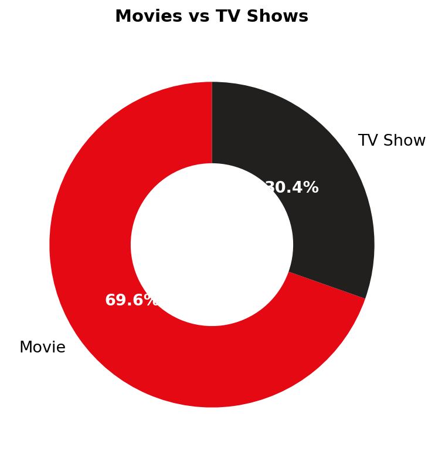
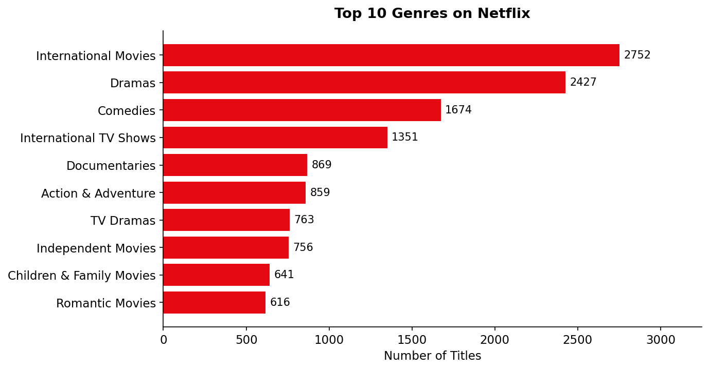
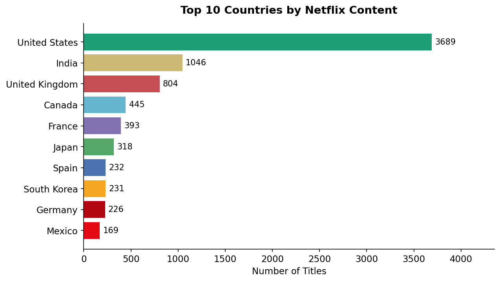
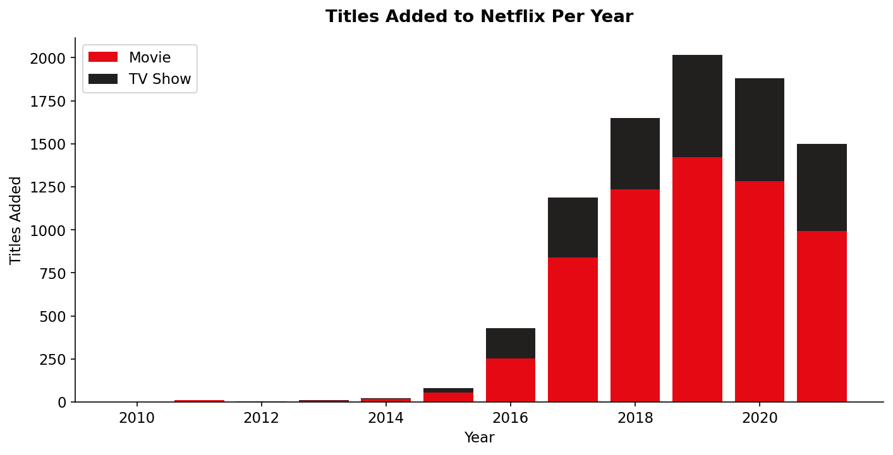
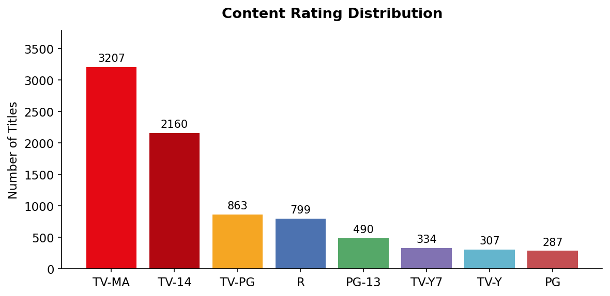

# 🎬 Netflix Movies & TV Shows Analysis

An exploratory data analysis (EDA) of Netflix's content catalog using Python. This project uncovers trends in content type, genres, countries, and how Netflix's library has grown over time.

---

## 📌 Project Overview

Netflix hosts thousands of movies and TV shows from around the world. This project analyzes the **Netflix Movies and TV Shows dataset** to answer key questions:

- What is the split between movies and TV shows?
- Which genres dominate the catalog?
- Which countries produce the most Netflix content?
- How has Netflix's content library grown over time?
- What are the most common content ratings?

---

## 📁 Repository Structure

```
netflix-analysis/
│
├── data/
│   └── netflix_titles.csv            # Raw dataset
│
├── charts/
│   ├── chart1_content_type.png
│   ├── chart2_top_genres.png
│   ├── chart3_top_countries.png
│   ├── chart4_titles_per_year.png
│   └── chart5_content_ratings.png
│
├── netflix_analysis.py               # Main analysis script
├── requirements.txt                  # Python dependencies
└── README.md
```

---

## 📊 Dataset

- **Source:** [Kaggle – Netflix Movies and TV Shows](https://www.kaggle.com/datasets/shivamb/netflix-shows)
- **Records:** 8,807 titles
- **Time Range:** 2008 – 2021
- **Key Columns:** `type`, `title`, `country`, `date_added`, `release_year`, `rating`, `listed_in`

---

## 🔧 Setup & Installation

### 1. Clone the repository
```bash
git clone https://github.com/YOUR_USERNAME/netflix-analysis.git
cd netflix-analysis
```

### 2. Install dependencies
```bash
pip install -r requirements.txt
```

### 3. Add the dataset
Download `netflix_titles.csv` from [Kaggle](https://www.kaggle.com/datasets/shivamb/netflix-shows) and place it in the `data/` folder.

### 4. Run the analysis
```bash
python netflix_analysis.py
```

Charts will be saved and key findings printed to the console.

---

## 📈 Key Findings

| Insight | Detail |
|---|---|
| 🎬 Movies in catalog | **69.6%** of all titles |
| 📺 TV Shows in catalog | **30.4%** of all titles |
| 🎭 Most common genre | **International Movies** (2,752 titles) |
| 🌍 Top producing country | **United States** (3,689 titles) |
| 📅 Peak content year | **2019** |
| 🔞 Most common rating | **TV-MA** (3,207 titles) |

### Content Type
Movies make up nearly **70%** of Netflix's catalog, with TV Shows accounting for the remaining 30%. This reflects Netflix's roots as a movie streaming platform before expanding into original series.

### Genres
**International Movies** and **Dramas** are the two most common genres, highlighting Netflix's global content strategy and focus on story-driven content. Comedies come in third.

### Countries
The **United States** dominates with 3,689 titles — more than triple the next closest country, **India** (1,046). The UK, Canada, and France round out the top 5, showing strong Western representation.

### Growth Over Time
Netflix saw explosive content growth from 2015 onwards, peaking in **2019** before slowing in 2020–2021, likely impacted by COVID-19 production delays.

---

## 📉 Charts

### Movies vs TV Shows


### Top 10 Genres


### Top 10 Countries


### Titles Added Per Year


### Content Rating Distribution


---

## 🛠 Methods

1. **Data Cleaning** — handled missing values in director, cast, and country fields; parsed date strings using `pandas`
2. **Exploratory Analysis** — exploded multi-value genre and country columns, grouped and aggregated using `groupby` and `value_counts`
3. **Visualization** — created donut chart, bar charts, and stacked bar chart using `matplotlib`
4. **Insight Generation** — summarized findings into key business and content observations

---

## 🧰 Tech Stack

| Tool | Purpose |
|---|---|
| Python 3.x | Core language |
| pandas | Data loading, cleaning, and analysis |
| matplotlib | Data visualization |

---

## 📄 License

This project is open source and available under the [MIT License](LICENSE).

---

## 🙋 Author

Made with Python and a Netflix subscription. Feel free to fork, star ⭐, or open an issue!
